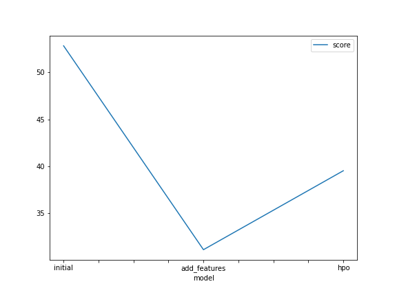
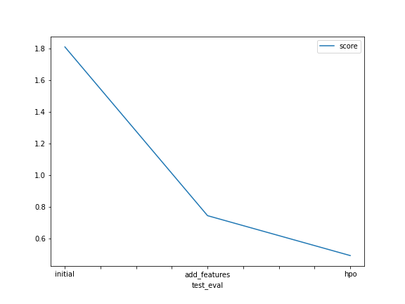

# Report: Predict Bike Sharing Demand with AutoGluon Solution
#### Kareem Elshishtawy

## Initial Training
### What did you realize when you tried to submit your predictions? What changes were needed to the output of the predictor to submit your results?
I was actually guided through the template to remove negative values from my predictions before submitting them to Kaggle. So, I believe this might have been the constraint preventing me from submitting my predictions. Otherwise, I didn't realize anything because my submission went smoothly with outputting the public and private scores.

### What was the top ranked model that performed?
WeightedEnsemble_L3 was the initial training top-ranked model, which combines prediction from all the individual models achieved the best prediction performance

## Exploratory data analysis and feature creation
### What did the exploratory analysis find and how did you add additional features?
After the initial Exploratory data analysis, I thought adding an hours column and changing seasons to categories might increase the quality of prediction but the improvement was unsatisfying at all. 

Then, I found that there are much more useful data in the dataset that can be utilized. From the hours, I made another column indicating the rush hours that might have higher demand. From the .describe() function on the data, I got to create other columns indicating the hot and cold temperatures along with the higher and lower level of humidity and wind speed. With all these more informative features added, the model performed quite well using the same default training parameters without any optimizations to the training itself.

### How much better did your model preform after adding additional features and why do you think that is?
The initial kaggle score without any feature engnieering was 1.810. After adding the new features of rush hours along with features related to temprature, humidty, and wind speeds. The model improvement was quite noticeable and reached a kaggle score of 0.746.

Please note that I have added new features on two phases. The first phase was adding the hours column and changing seasons to category type and this didnt affect the score much. So, I worked on a second phase of feature engineering that included adding rush hours along with features related to high and low temperatures, humidity, and wind speeds. Actually, this second phase of feature engineering was the one that quite improved the kaggle score to be a score of 0.746.

I think this happened because adding more informative features to the dataset enables the machine-learning models to utilize these features to make better predictions. If, for example, it knows the specific prediction it must make is within the rush hours, the feature will better guide the model to know there might be higher demand.

## Hyper parameter tuning
### How much better did your model preform after trying different hyper parameters?
The slight increase in the score value from 31 to 39 after the hyperparameter tuning might be a sign of overfitting given the specific focus on the 3 models. Still, using complex models like XGBoost and tuning their parameters to have more different learning rates, max depth, or other several parameters like the num of leaves for gradient boosting machine improved the overall performance with a noticeable increase of the Kaggle score from 0.75 to 0.49. Using ag.space tool also proved useful in making AutoGluon automatically explore different combinations of hyperparameters during the hyperparameter tuning process.

### If you were given more time with this dataset, where do you think you would spend more time?
I think I would have done more exploratory data analysis. The performance of the model increased sharply after specifying some new useful features to the same model, and I haven't yet explored other columns like "atemp" or made a combination of two columns to come up with a more important feature.

Also, the hyperparameters tuning process can push the performance a little further. If I were given more time, I would have researched the hyperparameters more and the different models that might prove useful in the specific prediction metric of regression based on relatively few features like the bike sharing demand dataset.

### Create a table with the models you ran, the hyperparameters modified, and the kaggle score.
|model|hpo1|hpo2|hpo3|score|
|--|--|--|--|--|
|initial|default|default|default|1.81009|
|add_features|default|default|default|0.74577|
|hpo|XGBoost(XGB): n_estimators: ag.space.Int(lower=100, upper=400, default=100), max_depth: ag.space.Int(lower=4, upper=12, default=6), learning_rate: ag.space.Real(1e-4, 1e-2, default=5e-4, log=True)|CatBoost(CAT): 'iterations' : 100, 'learning_rate': ag.space.Real(1e-4, 1e-2, default=5e-4, log=True), 'depth' : ag.space.Int(lower=6, upper=10)|Gradient Boosting Machine(GBM): 'num_boost_round': 100, 'num_leaves': ag.space.Int(lower=26, upper=66, default=36)|0.49407|

### Create a line plot showing the top model score for the three (or more) training runs during the project.

TODO: Replace the image below with your own.

### Create a line plot showing the top kaggle score for the three (or more) prediction submissions during the project.

TODO: Replace the image below with your own.

## Summary
Overall, the initial training lacked critical feature engineering to further increase the performance, and the performance could be increased even more with the right hyperparameters tuning.

Augluon proved to be extremely useful providing a quick deployment headstart to give the user more time to focus on feature engineering and hyperparameter tuning.

Feature engineering proved to be a crucial roleplayer in the performance of the machine-learning models even without tuning the models themself.

hyperparameter tuning showed how using the right hyperparameters can give you an even more powerful machine-learning model.

And finally, combining Autogluon with wise feature engineering and experience in hyperparameters tuning creates a powerful toolkit that can be used on other real-world problems rather than predicting the bike-sharing demand.
